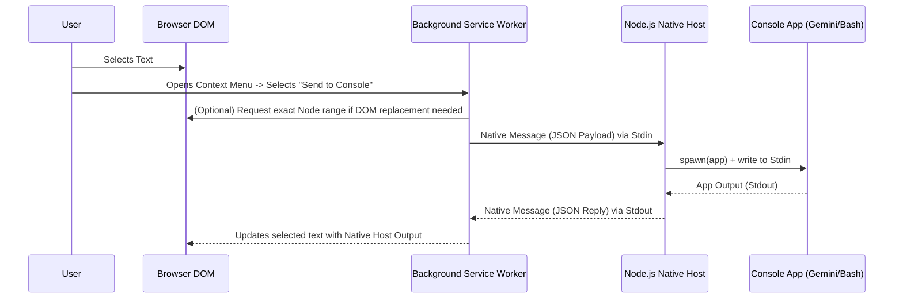

# Architecture: Chrome2Console

## System Components

1.  **Browser Context (Web Page)**
    *   **Role**: Where the user selects text to process.
    *   **Technology**: Content Scripts injected by the Chrome extension.
    *   **Behavior**:
        1. Reads the current `window.getSelection()`.
        2. Waits for commands from the background service worker.
        3. Replaces the highlighted DOM text with processed text returned by the background script.

2.  **Chrome Extension Background (Service Worker)**
    *   **Role**: The coordinator inside the browser environment.
    *   **Technology**: Manifest V3 Service Worker.
    *   **Behavior**:
        1. Registers the **Context Menu** option (e.g., "Send to Console").
        2. When clicked, it queries the active tab to extract the highlighted text, or relies on the Context Menu payload `info.selectionText`.
        3. Dispatches the selected text to the local system using `chrome.runtime.sendNativeMessage("com.gnuton.chrome2console", { text: selectedText })`.
        4. Receives the final output back from the Native Host and signals the Content Script to perform the text replacement.

3.  **Native Messaging Host (Node.js)**
    *   **Role**: The bridge between the sandboxed browser environment and the local operating system.
    *   **Technology**: Node.js script.
    *   **Behavior**:
        1. Listens on `stdin` for binary chunks framed per the Chrome Native Messaging protocol (a 4-byte message length prefix followed by a JSON payload).
        2. Parses the JSON.
        3. Invokes the underlying local console application (e.g., a python shell or gemini client) via `child_process.spawn()` or `exec()`, passing the text as stdin or an argument.
        4. Retrieves the string output from the command, packages it into a JSON dictionary, prefixes it with a 32-bit integer length header, and pipes it back to `stdout`.

## Security Boundaries

Because this extension interfaces a web browser with local command execution, security controls are paramount. The Node.js application **MUST NOT** accept arbitrary shell commands from the browser. It should be hardcoded to only run authorized predefined applications, with the text payload passed carefully through standard input to avoid command-injection vulnerabilities.

## Data Flow Diagram

